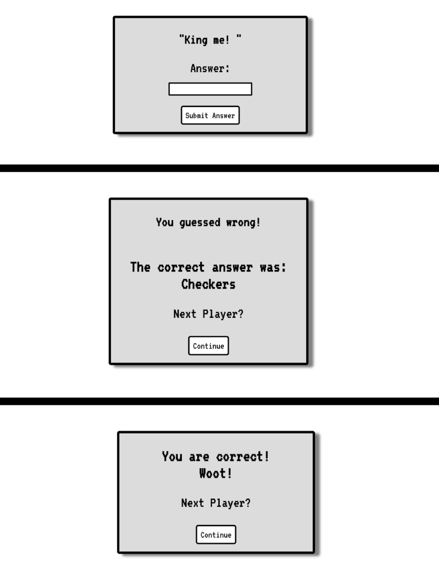

# Jeopardy
Play the classic game of Jeopardy with friends! A two person project involving Javascript OOP and JQuery

## Installation

`https://github.com/rdren0/Game-Time-Jeopardy.git`

In the project directory, please run:

`npm install`
`npm start`


### Screenshots


----------------------------------------------------------------------------------------------------------------------------
----------------------------------------------------------------------------------------------------------------------------
A few examples of screens in the game:

The question screens:



----------------------------------------------------------------------------------------------------------------------------
----------------------------------------------------------------------------------------------------------------------------

## The link to Github sites view:
https://rdren0.github.io/Game-Time-Jeopardy/

## Dependecies
Once you have cloned the repo, install the library dependencies. Run:
```bash
npm install
```
To verify that it is setup correctly, run `npm start` in your terminal. Go to `http://localhost:8080/` and you should see a page with some `h1` text and a pink background. If that's the case, enter `control + c` in your terminal to stop the server.


